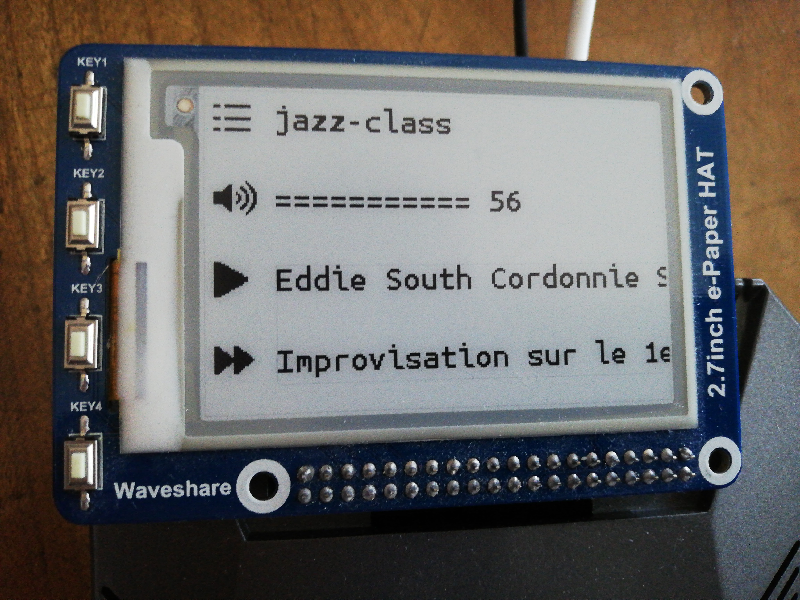

# mpdDisplay

Use your waveshare 2.7 E-ink to display song infos and control mpd!
`foldersToMPDPlaylists.py` sets up the folders in the music directory as mpd playlists.

### Requirements
- 
- 
- 
-  

### Paths:
`/home/pi/Music` as the Music directory.
`/home/pi/mpdDisplay` for this repo.

### Setup mpdDisplay as a service:
~~~
mkdir -p ~/.config/systemd/user/
ln -s mpdDisplay.service ~/.config/systemd/user/
systemctl --user enable mpdDisplay
~~~
